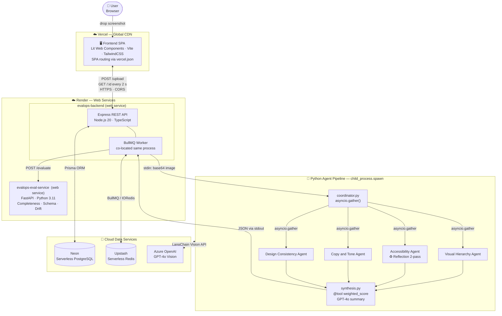
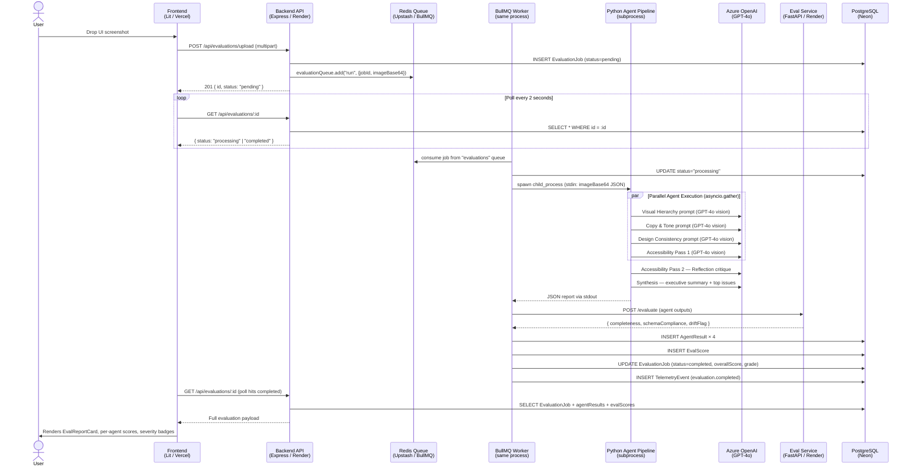
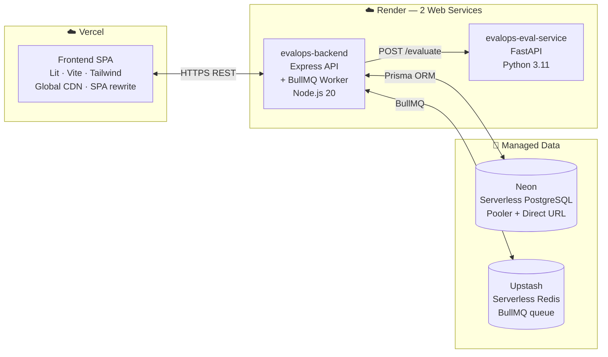

# UXEvalOpsAI — Multi-Agent UX Evaluation Platform

[](https://www.typescriptlang.org/)
[](https://www.python.org/)
[](https://langchain.com/)
[](https://www.prisma.io/)
[](https://bullmq.io/)
[](https://azure.microsoft.com/en-us/products/ai-services/openai-service)

> A **production-grade, multi-agent AI platform** that evaluates UI/UX screenshots against accessibility, visual design, copy tone, and consistency standards — orchestrating **4 parallel LangChain agents** backed by Azure OpenAI GPT-4o, a BullMQ async job queue, a FastAPI evaluation scoring service, and a real-time Lit Web Component frontend.

---

## Table of Contents

1. [System Architecture](#1-system-architecture)
2. [Request Lifecycle — End-to-End Data Flow](#2-request-lifecycle--end-to-end-data-flow)
3. [AI Agent Pipeline Deep Dive](#3-ai-agent-pipeline-deep-dive)
4. [Four Named AI Patterns](#4-four-named-ai-patterns)
5. [Database Schema](#5-database-schema)
6. [API Reference](#6-api-reference)
7. [Security Design](#7-security-design)
8. [Infrastructure & Deployment](#8-infrastructure--deployment)
9. [Tech Stack](#9-tech-stack)
10. [Environment Variables](#10-environment-variables)
11. [Local Development](#11-local-development)
12. [Key Interview Concepts](#12-key-interview-concepts)

---

## 1. System Architecture

> **Open the full interactive diagram:** [docs/diagrams/system-architecture.drawio](docs/diagrams/system-architecture.drawio) — viewable in VS Code with the [Draw.io extension](https://marketplace.visualstudio.com/items?itemName=hediet.vscode-drawio) or at [diagrams.net](https://app.diagrams.net/).



---

## 2. Request Lifecycle — End-to-End Data Flow



---

## 3. AI Agent Pipeline Deep Dive

```
python-agents/
├── main.py              ← Entry: reads stdin JSON, calls coordinator, writes stdout JSON
├── coordinator.py       ← Orchestrator: asyncio.gather → 4 agents → synthesis
└── agents/
    ├── base.py          ← create_llm() / create_agent_chain() — shared LangChain factory
    ├── visual_hierarchy.py   ← Layout + info architecture audit
    ├── accessibility.py      ← WCAG 2.1 AA audit — REFLECTION PATTERN (2-pass)
    ├── copy_tone.py          ← Microcopy, CTA, error message tone audit
    ├── consistency.py        ← Design token, brand coherence audit
    └── synthesis.py          ← @tool weighted score + GPT-4o synthesis
```

### How each agent produces output

Every specialist agent (visual_hierarchy, copy_tone, consistency) follows the same structure:

1. **`create_agent_chain(system_prompt)`** builds a `LangChain` chain:
   ```
   PromptTemplate | AzureChatOpenAI (vision) | JsonOutputParser
   ```
2. The chain is invoked with `{ image_base64, evaluation_prompt }`.
3. The LLM is instructed to return **only valid JSON** in this shape:
   ```json
   {
     "score": 78,
     "status": "warning",
     "findings": [{ "severity": "high", "title": "...", "detail": "..." }],
     "recommendation": "..."
   }
   ```
4. `JsonOutputParser` parses and validates the output automatically.
5. The agent wraps the result with `agent`, `reflected`, and `durationMs` fields before returning.

---

## 4. Four Named AI Patterns

### Pattern 1 — Parallelization (`coordinator.py`)

```python
# ALL 4 agents run concurrently — NOT sequentially
results = await asyncio.gather(
    asyncio.to_thread(visual_hierarchy.evaluate, image_base64),
    asyncio.to_thread(accessibility.evaluate, image_base64),
    asyncio.to_thread(copy_tone.evaluate, image_base64),
    asyncio.to_thread(consistency.evaluate, image_base64),
    return_exceptions=True,   # ← one agent failure doesn't kill the rest
)
```

**Why it matters:** Without parallelization, 4 sequential LLM calls at ~3–5s each = 12–20s. With `asyncio.gather`, total wall time ≈ the slowest single agent (~5s). `return_exceptions=True` makes the pipeline **fault-tolerant** — a failed agent produces a fallback result instead of crashing the whole job.

---

### Pattern 2 — Reflection (`agents/accessibility.py`)

```
Pass 1 — Initial evaluation
    System: "You are a WCAG 2.1 AA expert. Audit this screenshot."
    → { score, findings, recommendation }

Pass 2 — Reflection / self-critique
    System: "You are a senior reviewer. Here is a junior analyst's evaluation.
             Identify missed issues, false positives. Improve and return final result."
    Input:  [screenshot image] + [Pass 1 JSON output]
    → { improved score, refined findings, sharper recommendation }
```

The reflected output sets `"reflected": true` in the final result, which the frontend surfaces with a ✓ badge. This pattern mimics how senior engineers review a junior's PR before merging.

**Why it matters:** Single-pass LLMs hallucinate or under-report. Reflection gives the model a chance to catch its own errors — measurably improving output quality without human intervention.

---

### Pattern 3 — Tool Use (`agents/synthesis.py`)

```python
@tool
def calculate_weighted_score(
    visual_score: int,
    accessibility_score: int,
    copy_score: int,
    consistency_score: int,
) -> dict:
    """
    Domain-specific weights:
    - Accessibility:  35%  (WCAG compliance is legally critical)
    - Consistency:    25%  (brand coherence impacts trust)
    - Visual:         20%  (task completion rate)
    - Copy & Tone:    20%  (comprehension)
    """
    weighted = (
        accessibility_score * 0.35 + consistency_score * 0.25 +
        visual_score * 0.20 + copy_score * 0.20
    )
    grade = "A" if weighted >= 90 else "B" if weighted >= 80 else ...
    return { "overallScore": round(weighted), "grade": grade, "weights": {...} }
```

The coordinator calls `calculate_weighted_score.invoke({...})` — a **LangChain `@tool`** — before passing the score data to the synthesis LLM. The LLM does NOT compute scores itself; a deterministic function does, removing hallucinated arithmetic.

**Why it matters:** LLMs are unreliable at math. Externalizing computation into a typed, deterministic tool ensures the score is always correct and auditable.

---

### Pattern 4 — Orchestrator-Synthesis (`coordinator.py` + `agents/synthesis.py`)

```
coordinator.py (Orchestrator)
    1. Receives raw image
    2. Fans out to 4 specialist agents (Parallelization)
    3. Collects all 4 results
    4. Calls calculate_weighted_score @tool (Tool Use)
    5. Passes everything to synthesize()

synthesis.py (Synthesis)
    1. Receives 4 agent JSON reports + weighted score
    2. Sends to GPT-4o with "senior UX lead" system prompt
    3. Returns:
       - topIssues[]  — top 3 cross-agent issues ranked by impact
       - summary      — 2–3 sentence executive summary for product teams
```

**Why it matters:** No single agent has full context. The synthesis step aggregates specialist knowledge into a coherent, stakeholder-facing narrative — the same mental model as a design review meeting where multiple experts share their findings with a facilitator.

---

## 5. Database Schema

```
┌─────────────────────────────────────────────────────────────────┐
│                        EvaluationJob                            │
│  id (cuid PK) │ status │ imageFileName │ imageBase64 (Text)     │
│  overallScore │ grade  │ summary (Text) │ topIssues (String[])  │
│  durationSeconds │ createdAt │ updatedAt                        │
└────────────┬────────────────────────────────────────────────────┘
             │ 1:N (onDelete: Cascade)
    ┌────────┴────────────────────────────────────────────────────┐
    │                                                             │
    ▼                                                             ▼
┌───────────────────────┐             ┌────────────────────────┐
│      AgentResult      │             │         Review         │
│  id │ evaluationId    │             │  id │ evaluationId     │
│  agentName │ score    │             │  agentName │ action    │
│  status │ findings    │             │  comment │ reviewedAt  │
│  (Json)               │             └────────────────────────┘
│  recommendation (Text)│
│  reflected (Boolean)  │             ┌────────────────────────┐
│  durationMs           │             │    TelemetryEvent      │
└───────────────────────┘             │  id │ evaluationId     │
                                      │  event │ metadata (Json)│
┌───────────────────────┐             │  timestamp             │
│       EvalScore       │             └────────────────────────┘
│  id │ evaluationId    │
│  completeness (Float) │
│  schemaCompliance     │
│  humanAgreement       │
│  driftFlag (Boolean)  │
│  createdAt            │
└───────────────────────┘
```

**Key design decisions:**
- `imageBase64` stored as `@db.Text` in PostgreSQL — avoids file storage service for demo scale
- All child tables use `onDelete: Cascade` — deleting a job cleans up all related records atomically
- `findings` on `AgentResult` is `Json` — flexible schema for LLM output that varies per agent
- `metadata` on `TelemetryEvent` is `Json` — extensible event payload without schema migrations
- `EvalScore` is separate from `AgentResult` — the eval service is an independent scoring layer

---

## 6. API Reference

### Evaluations

| Method | Endpoint | Description |
|--------|----------|-------------|
| `POST` | `/api/evaluations/upload` | Upload image (multipart/form-data, field: `image`). Returns `{ id, status: "pending" }` |
| `GET` | `/api/evaluations` | List all evaluations with agent/review counts |
| `GET` | `/api/evaluations/:id` | Full evaluation with agentResults, reviews, evalScores, telemetry |
| `DELETE` | `/api/evaluations/:id` | Delete evaluation (cascades to all child records) |
| `GET` | `/api/evaluations/telemetry/summary` | Aggregate stats: totalEvaluations, avgScore, successRate |

### Reviews

| Method | Endpoint | Description |
|--------|----------|-------------|
| `POST` | `/api/reviews` | Submit human review action (`approve`/`reject`/`escalate`) for an agent result |
| `GET` | `/api/reviews` | List all pending reviews |

### Eval Service (internal)

| Method | Endpoint | Description |
|--------|----------|-------------|
| `POST` | `/evaluate` | Score agent outputs: completeness, schema compliance, drift flag |
| `GET` | `/metrics` | Aggregate eval metrics |
| `GET` | `/health` | Health check |

### Job Status Values

| Status | Meaning |
|--------|---------|
| `pending` | Job created, waiting in Redis queue |
| `processing` | Worker picked up the job, agents are running |
| `completed` | All agents finished, results persisted |
| `failed` | Worker hit an unrecoverable error after 3 retries |

---

## 7. Security Design

### Applied Controls

| Concern | Implementation |
|---------|---------------|
| **Security Headers** | `helmet()` middleware — sets `Content-Security-Policy`, `X-Frame-Options`, `X-Content-Type-Options`, `Strict-Transport-Security`, `Referrer-Policy` |
| **CORS** | Allow-list of specific origins (`FRONTEND_URL`, localhost). All other origins rejected with 403. Methods restricted to `GET, POST, DELETE, OPTIONS`. |
| **Rate Limiting** | `express-rate-limit`: 100 requests / 15 minutes per IP on `/api/*`. Returns `429 Too Many Requests` with `Retry-After` header. |
| **File Upload Validation** | `multer` — restricts MIME type to `image/jpeg`, `image/png`, `image/webp`. 10 MB hard limit. Stored in-memory (no disk write). |
| **Input Validation** | `zod` schema on all environment variables at startup — fails fast with explicit error if config is invalid. |
| **SQL Injection** | Prisma ORM uses parameterised queries exclusively — no raw SQL anywhere in the codebase. |
| **Correlation IDs** | Every request gets a `x-correlation-id` header (generated if absent). Propagated through logs and error responses for traceability. |
| **Subprocess Safety** | Python subprocess receives only base64 image data via `stdin`. No shell expansion (`spawn`, not `exec`). 120-second timeout with `SIGTERM` on breach. |
| **Env Secret Isolation** | `dotenv` loaded once at startup. Azure OpenAI API key never logged or serialised into responses. |

### OWASP Top 10 Coverage

| OWASP Risk | Mitigation |
|------------|------------|
| A01 Broken Access Control | CORS + allowed-origins list |
| A02 Cryptographic Failures | HTTPS enforced via Render/Vercel; `sslmode=require` on DB |
| A03 Injection | Prisma parameterised queries; no shell execution with user data |
| A05 Security Misconfiguration | `helmet()` security headers; `NODE_ENV` validated |
| A06 Vulnerable Components | `npm audit` and `pip-audit` in CI |
| A08 Software/Data Integrity | `zod` input validation at every system boundary |

---

## 8. Infrastructure & Deployment



### Render Service Configuration (`render.yaml`)

| Service | Type | Runtime | Build Command | Start Command |
|---------|------|---------|---------------|---------------|
| `evalops-backend` | Web | Node 20 | `npm install --include=dev && npx prisma generate && tsc` | `node dist/index.js` |
| `evalops-eval-service` | Web | Python 3.11 | `pip install -r eval-service/requirements.txt` | `cd eval-service && uvicorn main:app --host 0.0.0.0 --port $PORT` |

### Why BullMQ Worker runs inside the Backend process

Render's free tier only supports `type: web` services (must bind an HTTP port). `type: worker` (long-running background processes) is a paid feature. The BullMQ worker is imported directly in `apps/backend/src/index.ts`:

```typescript
import './jobs/worker'   // Worker starts when the Express process starts
```

This co-location pattern is valid for low-to-medium throughput. For high scale, extract to a dedicated worker service.

### Neon + Prisma Migration Strategy

Neon provides two connection URLs:
- **Pooler URL** (`*-pooler.*.neon.tech`) — PgBouncer in transaction mode. Does NOT support PostgreSQL advisory locks.
- **Direct URL** (`*.neon.tech`) — Direct TCP to Postgres. Required for `prisma migrate deploy`.

The schema uses both:
```prisma
datasource db {
  provider  = "postgresql"
  url       = env("DATABASE_URL")          // pooler — used at runtime (connection efficiency)
  directUrl = env("DIRECT_DATABASE_URL")   // direct — used only by prisma migrate
}
```

---

## 9. Tech Stack

| Layer | Technology | Rationale |
|-------|-----------|-----------|
| **Frontend** | Lit Web Components + Vite + TailwindCSS | Native web components, no heavy framework, fast HMR |
| **Backend** | Node.js 20 + TypeScript + Express | Typed, async-first, industry standard REST |
| **Job Queue** | BullMQ + Redis | Durable async jobs, retries, backoff, job history |
| **Database ORM** | Prisma + PostgreSQL | Type-safe queries, schema migrations, relation loading |
| **Database Host** | Neon (serverless Postgres) | Scales to zero, branching, connection pooler built-in |
| **Redis Host** | Upstash | Serverless Redis, free tier, REST + native protocol |
| **AI Agents** | Python 3.11 + LangChain 0.3 | Best LLM tooling ecosystem, asyncio concurrency |
| **LLM** | Azure OpenAI GPT-4o (vision) | Multimodal, enterprise SLA, no OpenAI.com rate limits |
| **Eval Service** | FastAPI + Pydantic | High-performance async Python API, automatic docs |
| **Frontend Deploy** | Vercel | Git-push deploy, global CDN, SPA routing |
| **Backend Deploy** | Render | Docker-free web services, free tier |
| **Validation** | Zod (TS) + Pydantic (Python) | Schema-first runtime validation at system boundaries |
| **Logging** | pino (structured JSON logs) | Machine-readable, correlation IDs, log levels |

---

## 10. Environment Variables

### `apps/backend` (Render `evalops-backend`)

| Variable | Required | Description |
|----------|----------|-------------|
| `DATABASE_URL` | ✅ | Neon **pooler** connection string (runtime queries) |
| `DIRECT_DATABASE_URL` | ✅ | Neon **direct** connection string (Prisma migrations only) |
| `REDIS_URL` | ✅ | Upstash Redis URL (`rediss://...`) |
| `FRONTEND_URL` | ✅ | Deployed Vercel URL — added to CORS allow-list |
| `EVAL_SERVICE_URL` | ✅ | `https://evalops-eval-service.onrender.com` |
| `NODE_ENV` | ✅ | `production` |
| `PORT` | — | Set automatically by Render |
| `PYTHON_PATH` | — | Defaults to `python3` |

### `python-agents` (subprocess, inherits backend env)

| Variable | Required | Description |
|----------|----------|-------------|
| `AZURE_OPENAI_API_KEY` | ✅ | Azure OpenAI API key |
| `AZURE_OPENAI_ENDPOINT` | ✅ | `https://<your-resource>.openai.azure.com/` |
| `AZURE_OPENAI_DEPLOYMENT_NAME` | ✅ | Deployment name (e.g. `gpt-4o`) |
| `AZURE_OPENAI_API_VERSION` | — | Defaults to `2024-02-01` |

### `eval-service` (Render `evalops-eval-service`)

| Variable | Required | Description |
|----------|----------|-------------|
| `PORT` | — | Set automatically by Render |

### `apps/frontend` (Vercel)

| Variable | Required | Description |
|----------|----------|-------------|
| `VITE_API_URL` | ✅ | `https://evalops-backend.onrender.com` |

---

## 11. Local Development

### Prerequisites

- Node.js 20+
- Python 3.11+
- Docker Desktop (for local Redis + Postgres)

### 1. Start infrastructure

```bash
docker compose up -d
# Starts: postgres:16 on :5432, redis:7 on :6379
```

### 2. Install dependencies

```bash
# Node — monorepo root
npm install

# Python
pip install -r python-agents/requirements.txt
pip install -r eval-service/requirements.txt
```

### 3. Configure environment

```bash
# Backend
cp apps/backend/.env.example apps/backend/.env
# Set: DATABASE_URL, REDIS_URL, AZURE_OPENAI_API_KEY, AZURE_OPENAI_ENDPOINT, AZURE_OPENAI_DEPLOYMENT_NAME

# Python agents
cp python-agents/.env.example python-agents/.env
# Set: AZURE_OPENAI_API_KEY, AZURE_OPENAI_ENDPOINT, AZURE_OPENAI_DEPLOYMENT_NAME

# Frontend
cp apps/frontend/.env.example apps/frontend/.env
# Set: VITE_API_URL=http://localhost:3001
```

### 4. Database setup

```bash
cd apps/backend
npx prisma migrate dev
npx prisma db seed
```

### 5. Run all services

```bash
# Terminal 1 — Backend API + Worker (co-located)
npm run dev --workspace=apps/backend

# Terminal 2 — Python Eval Service
cd eval-service && uvicorn main:app --reload --port 8000

# Terminal 3 — Frontend
npm run dev --workspace=apps/frontend
```

Open [http://localhost:5173](http://localhost:5173)

---

## 12. Key Interview Concepts

### Async Job Queue (BullMQ + Redis)

**Why not process synchronously?**
AI agent calls to GPT-4o take 10–30 seconds. Keeping an HTTP connection open that long is unreliable (proxies time out, client disconnects, server OOMs). The queue pattern decouples submission from processing:

- Client submits job → gets `{ id, status: "pending" }` instantly (201 ms)
- Client polls every 2 seconds until `status === "completed"`
- Worker processes independently, retries on failure

**BullMQ retry policy:**
```typescript
defaultJobOptions: {
  attempts: 3,
  backoff: { type: 'exponential', delay: 5000 },  // 5s → 25s → 125s
  removeOnComplete: 100,   // keep last 100 completed jobs for debugging
  removeOnFail: 50,
}
```

### Polling vs WebSocket vs SSE

This system uses **client-side polling** (2-second interval). Here's the tradeoff table:

| Approach | Latency | Complexity | Suitable For |
|----------|---------|------------|--------------|
| Polling | ~2s extra | Low | Short-lived jobs (<60s) ✅ |
| SSE | ~0s | Medium | One-way server push |
| WebSocket | ~0s | High | Bidirectional real-time |

For AI jobs averaging 15–30s, polling adds at most 2s overhead — acceptable. SSE/WebSocket would require stateful server infrastructure (not compatible with Render free tier scaling).

### Multi-Agent vs Single-Agent

| Factor | Multi-Agent (this system) | Single-Agent |
|--------|--------------------------|--------------|
| **Specialization** | Each agent has a focused system prompt = better precision | One prompt tries to cover everything |
| **Parallelism** | `asyncio.gather` = 4× faster | Sequential = slower |
| **Fault isolation** | One agent fails → others complete | Full failure |
| **Cost** | 4+ LLM calls per evaluation | 1 LLM call |
| **Interpretability** | Score per domain + findings per agent | Single opaque score |

### Prisma + Neon Connection Pooling

Neon's serverless Postgres spins up and down. Without a connection pooler, each Lambda/serverless function creates a new TCP connection — Postgres can handle ~100 max connections. Neon's built-in **PgBouncer pooler** (transaction mode) multiplexes many connections into few.

**Trade-off:** PgBouncer transaction mode drops session-level features: `SET`, temporary tables, and **advisory locks**. Prisma migrations use advisory locks to prevent concurrent schema changes. Solution: `directUrl` bypasses pooler for migrations only.

### LangChain `JsonOutputParser`

Rather than manual `json.loads(llm_output)` with try/except, LangChain's `JsonOutputParser` is composed at the end of the LCEL chain:

```
ChatPromptTemplate | AzureChatOpenAI | JsonOutputParser
```

If the LLM returns invalid JSON (markdown fences, partial output), the parser raises a structured error that the retry wrapper catches. This is the **chain-of-responsibility** pattern applied to LLM output parsing.

### Weighted Scoring — Why Deterministic, Not LLM

Asking GPT-4o "give me a weighted average of these 4 scores" leads to arithmetic hallucinations and inconsistent weights. The `@tool calculate_weighted_score` function:

1. Is **deterministic** — same inputs always produce the same output
2. Is **auditable** — weights are documented in code (`Accessibility: 35%` — legally critical)
3. Is **testable** — pure function, no mocks needed
4. Separates **computation** from **language generation**

The LLM then receives the computed score as a fact and focuses on what it's good at: synthesizing text.

### Frontend Architecture — Lit Web Components

Lit is built on the **Web Components standard** (`CustomElementRegistry`, Shadow DOM, `<template>`). Unlike React/Vue:
- No virtual DOM — updates go directly to real DOM
- Shadow DOM encapsulates styles — no CSS leakage between components
- Components are **native browser elements** — work in any framework or vanilla HTML
- `@state()` decorator triggers reactive re-renders on property change (similar to `useState`)
- `@customElement('page-evaluate')` registers `<page-evaluate>` as a browser-native element

### Eval Service — Independent Quality Gate

The `eval-service` (FastAPI) is deliberately **separate from the agent pipeline**:
- **Completeness scoring**: Did all required JSON fields arrive?
- **Schema compliance**: Are score values in 0–100? Are statuses valid enum values?
- **Drift detection**: Is this evaluation's score dramatically different from recent average? (Flags potential LLM behavior drift)

This is the **separation of concerns** principle: agents produce outputs; the eval service measures the quality of those outputs without influencing them.

### Telemetry Design

Every significant event is recorded as a `TelemetryEvent`:

```
evaluation.created   → { fileName }
evaluation.completed → { overallScore, grade, durationSeconds }
evaluation.failed    → { error }
```

The `GET /api/evaluations/telemetry/summary` endpoint aggregates:
- `totalEvaluations` — count
- `avgScore` — `_avg` aggregate
- `avgDuration` — `_avg` aggregate
- `successRate` — `completed / total × 100`
- `topIssueCategories` — `groupBy agentName` ordered by count

This is a **OLAP-lite** pattern built on OLTP tables — pragmatic for demo scale.
```

Frontend: http://localhost:5173  
Backend API: http://localhost:3001  
Eval Service: http://localhost:8000/docs  

---

## Using a Standard OpenAI Key (No Azure)

In `python-agents/.env`:
```
# Comment out Azure vars:
# AZURE_OPENAI_API_KEY=...
# AZURE_OPENAI_ENDPOINT=...

# Add:
OPENAI_API_KEY=sk-...
```

The `create_llm()` function in `agents/base.py` auto-detects which key is available.

---

## API Reference

| Method | Path | Description |
|---|---|---|
| `POST` | `/api/evaluations/upload` | Upload image, returns pending job |
| `GET` | `/api/evaluations` | List all evaluations |
| `GET` | `/api/evaluations/:id` | Get full evaluation + agent results |
| `DELETE` | `/api/evaluations/:id` | Delete evaluation |
| `GET` | `/api/evaluations/telemetry/summary` | Platform metrics |
| `POST` | `/api/reviews` | Submit human review (approve/reject/escalate) |
| `GET` | `/api/reviews/pending` | List evaluations awaiting review |
| `GET` | `/health` | Health check |

---

## Deployment (Free Tier, ~$0-15/month)

| Service | Provider | Cost |
|---|---|---|
| PostgreSQL | Neon (free tier) | $0 |
| Redis | Upstash (free tier) | $0 |
| Backend + Worker | Render (free tier) | $0 (spins down after inactivity) |
| Frontend | Vercel (free tier) | $0 |

### Steps
1. Create Neon DB → copy connection string
2. Create Upstash Redis → copy connection string
3. Push repo to GitHub
4. Connect GitHub to Render → select `render.yaml` → set env vars
5. Connect GitHub to Vercel → select `apps/frontend` → deploy

---

## Project Structure

```
.
├── apps/
│   ├── backend/
│   │   ├── prisma/
│   │   │   ├── schema.prisma
│   │   │   └── seed.ts
│   │   └── src/
│   │       ├── config/
│   │       ├── jobs/           # BullMQ queue + worker
│   │       ├── middleware/
│   │       ├── routes/
│   │       ├── services/
│   │       ├── telemetry/
│   │       └── index.ts
│   └── frontend/
│       └── src/
│           ├── components/     # Lit Web Components
│           ├── pages/
│           ├── services/
│           └── app-shell.ts
├── python-agents/
│   ├── agents/
│   │   ├── base.py             # LLM factory (Azure/OpenAI)
│   │   ├── visual_hierarchy.py
│   │   ├── accessibility.py    # Reflection pattern
│   │   ├── copy_tone.py
│   │   ├── consistency.py
│   │   └── synthesis.py        # Tool Use + Orchestrator-Synthesis
│   ├── coordinator.py          # Parallelization pattern
│   └── main.py                 # stdin/stdout bridge
├── eval-service/
│   ├── routers/
│   │   ├── evaluate.py         # Completeness + schema scoring
│   │   └── metrics.py          # Trend metrics
│   └── main.py
├── docker-compose.yml
├── render.yaml
└── package.json                # npm workspaces root
```
